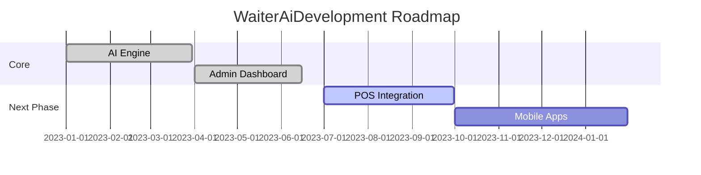

WaiterAI 🍽️✨  
**AI-Powered Restaurant Menu Management System**  

  
*"Where culinary art meets artificial intelligence"*

---

## 🌟 Creative Brief  
**Problem:** Restaurants face challenges with:  
- Static, uninspiring digital menus  
- Manual and time-consuming translation processes  
- Inefficient menu updates  
- Lack of customer engagement  

**Solution:** WaiterAI offers:  
- 🤖 **AI-Crafted Descriptions** - Automatically generate mouth-watering item descriptions  
- 🌍 **Multi-Language Support** - Real-time translations in 6 languages  
- 📱 **Smart Filtering** - Allergen/dietary filters that actually work  
- 📊 **Live Analytics** - Gain actionable insights on menu performance  

*"We don't just digitize menus - we revolutionize the dining experience with AI."*

---

## 📊 Market Positioning & Growth Strategy

### **Ideal Customer Profile**
- Mid-to-upscale restaurants with diverse menus.
- Establishments emphasizing wine/beverage programs.
- Tourist-area restaurants serving international clientele.
- Restaurants catering to dietary accommodations.

### **Go-to-Market Approach**
1. **Initial Launch**: High-end restaurants in urban tourist hubs.
2. **Partnerships**: Collaborate with restaurant associations and tourism boards.
3. **Expansion**: Target hotels, resorts, and cruise lines.

### **Growth Levers**
- Enhanced Analytics: Insights into popular items and viewing trends.
- Reservation Integration: Direct bookings via the app.
- Payment Processing: Seamless in-app payments.
- Marketing Tools: Loyalty programs and digital promotions.

---

## 🚀 Features  
- **AI WaitAssistant**: Ai-powered menu descriptions that boost sales  
- **Universal Menu**: Real-time translations in 6 Asian languages  (coming soon)
- **Smart Filters**: Dynamic dietary/allergen filtering system   (coming soon)
- **Glass UI**: Stunning frosted-glass interface design  
- **Dashboard Analytics**: Built-in analytics for data-driven decisions  
- **Admin Panel**: Manage menus, configure AI, and customize business profiles with ease  

### Admin Panel Preview  
Check out our user-friendly admin panel:  

  
  
  

---

## 🛠️ Installation  
### Prerequisites  
- Node.js (>= 16.x) and npm (>= 7.x)  
- Ensure you have proper permissions to clone the repository  

### Steps  
1. **Clone the repository**  
   ```bash
   git clone https://github.com/W3JDev/MenuMate-Prototype.git
   cd MenuMate-Prototype
   ```  

2. **Install dependencies**  
   ```bash
   npm install
   ```  

3. **Configure environment variables**  
   ```bash
   cp .env.example .env.local
   ```  

4. **Start development server**  
   ```bash
   npm run dev
   ```  

### Troubleshooting  
- If you encounter dependency errors, ensure your Node.js and npm versions are compatible.  
- For additional support, open an issue in the repository.  

---

## 📜 License  
**Proprietary Code**  
© 2023 W3JDev Solutions. All rights reserved.  

This codebase is **not open source** and is provided for reference only under these conditions:  
- ✅ May be referenced with **explicit credit** to W3JDev  
- ✅ Requires **written permission** for any usage  
- ❌ No commercial use without license  
- ❌ No redistribution of any kind  

*Violations will be prosecuted under intellectual property laws.*

---

## 🤝 Contribution Policy  
**Contribution by invitation only** - Currently accepting:  
- Security researchers (via responsible disclosure)  
- UI/UX designers for accessibility improvements  
- Restaurant industry consultants  

### Process  
1. Request contributor status via issues.  
2. Sign an NDA and contributor agreement.  
3. Fork the repository under supervision.  
4. Submit pull requests (PRs) after obtaining 2 maintainer approvals.  

---

## 📈 Project Status  


---

## 💡 Why This Matters  
*"Digital menus convert 23% better when using dynamic descriptions"* - *Hospitality Tech Report 2023*  

WaiterAiisn't just software - it's the future of restaurant management. By combining AI with deep industry knowledge, we're helping culinary businesses:  
- Reduce menu update time by 80%  
- Increase average order value by 15%  
- Improve customer satisfaction scores  

---

## ✨ Special Thanks  
- **W3JDev Team** - Core innovation  
- **Base44**, **V0Dev**, **Loveable** - Migration architecture  
- **Early Adopters** - Pilot restaurants  

---

## 🌟 Built With  
- **TypeScript** - For scalable and maintainable code  
- **CSS** - For stunning UI/UX  
- **JavaScript** - For dynamic functionality  

---

## 📧 Contact Us  
For licensing inquiries: **w3j.btc@gmail.com**  
For partnership opportunities: **w3j.btc@gmail.com**  

  
```

This updated README now includes the new "Market Positioning & Growth Strategy" section without duplicating or altering existing content. Let me know if you'd like further refinements!
